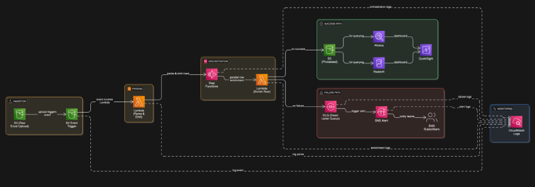

# Franchisee-Agentic-Enrichment

This repository contains a complete take-home assignment solution for enriching franchisee records with publicly available business information using a Python-based pipeline. The project also includes a **production-grade AWS deployment architecture** for scalable, fault-tolerant execution.

---


## 📁 Project Structure

```
├── .env                         # Local environment variables (API Keys etc.) — DO NOT UPLOAD
├── AWS-architecture.png        # Final AWS deployment architecture diagram
├── README.md                   # This file
├── granite_take_home_assignment.py  # Main Python script for enrichment
├── requirements.txt            # Python dependencies
```

---

## 📝 Objective

Build a system that:
1. Parses Excel files of franchisee data.
2. Enriches each record using external search APIs (e.g., Serper.dev).
3. Outputs enriched fields such as owner name, corporate address, contact details, and LinkedIn profile.
4. Includes a robust cloud deployment architecture (AWS used here) for real-world scalability and reliability.

---

## 🔧 How to Run This Project Locally

### 1. Clone the Repo

```bash
git clone https://github.com/dhyeyjoshi/Franchisee-Agentic-Enrichment.git
cd Franchisee-Agentic-Enrichment
```

### 2. Install Python Dependencies

Create a virtual environment (optional but recommended):

```bash
python -m venv venv
source venv/bin/activate  # On Windows: venv\Scripts\activate
```

Then install required libraries:

```bash
pip install -r requirements.txt
```

### 3. Set Up Environment Variables

Create a `.env` file at the root with the following:

```env
SERPER_API_KEY=your_serper_api_key_here
```

> ⚠️ Never commit this file to GitHub.

### 4. Prepare Your Input

Place your Excel file (e.g., `Golden Chick_DE_Takehome.xlsx`) in the root directory.

### 5. Run the Script

```bash
python granite_take_home_assignment.py
```

This will generate an output CSV file named `golden_chick_enriched_serper.csv` with enriched data.

---

## 🧩 Output Fields

Each record includes:

- Franchise Owner Name
- Legal Corporate Name
- Corporate Address
- Corporate Phone Number
- Corporate Email
- Franchise Owner LinkedIn URL (if available)
- Source URLs used for enrichment

---

## ☁️ Cloud Deployment Architecture

This solution is designed to run in a serverless, event-driven architecture using AWS services.

### 🔽 Architecture Diagram



### 🔍 Architecture Description

<!-- INSERT HERE: Description of the architecture shown in AWS-architecture.png -->

---

## ✅ Why This Setup?

- **Scalable**: Lambda + Step Functions handle parallel row enrichment.
- **Reliable**: DLQ + SNS + CloudWatch logging ensure no failure goes unnoticed.
- **Cost-effective**: Serverless compute and tiered storage.
- **Secure**: Sensitive keys kept in `.env`; alerts only trigger on real failures.

---

## 🧪 Notes

- Each request to Serper API is rate-limited using `time.sleep(1)` to stay within free-tier limits.
- CSV export is lightweight and easy to visualize or load into BI tools.
- Modular code structure for easy extension (e.g., adding more enrichment sources).

---

> Built with ❤️ by Dhyey Joshi
